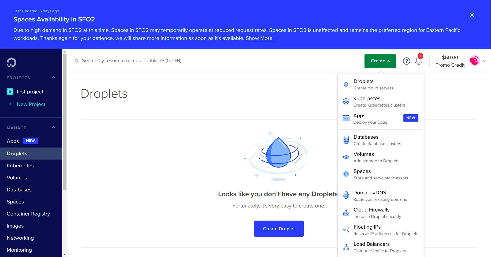
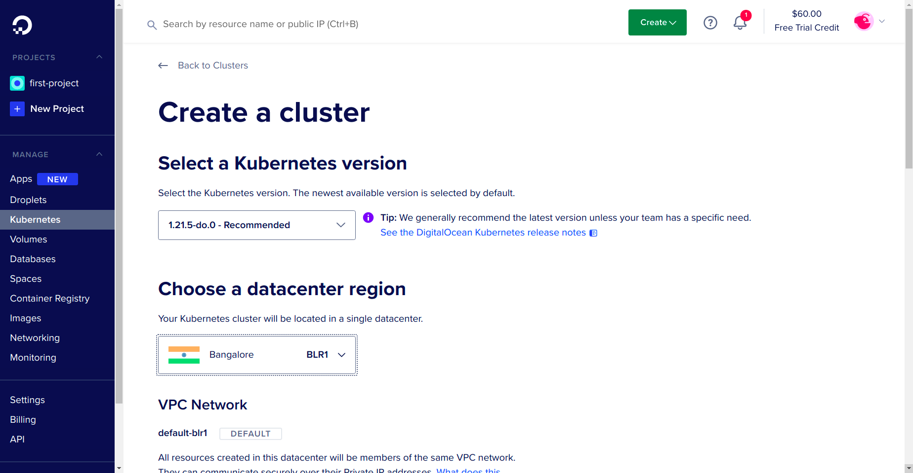
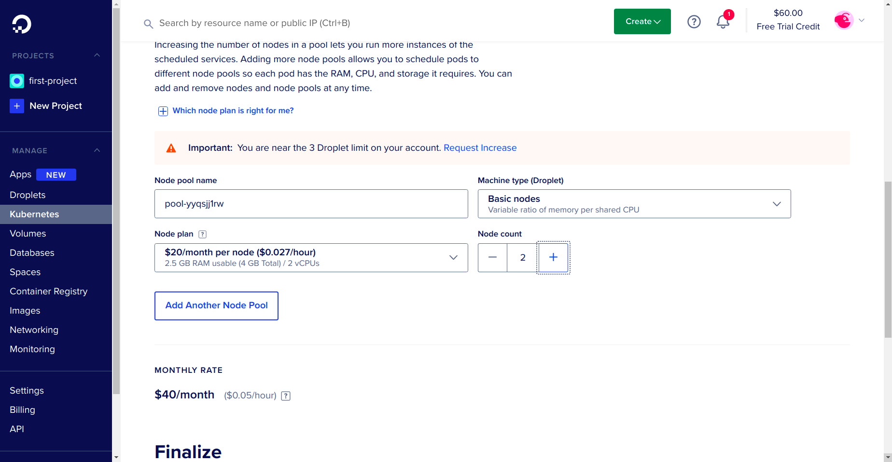
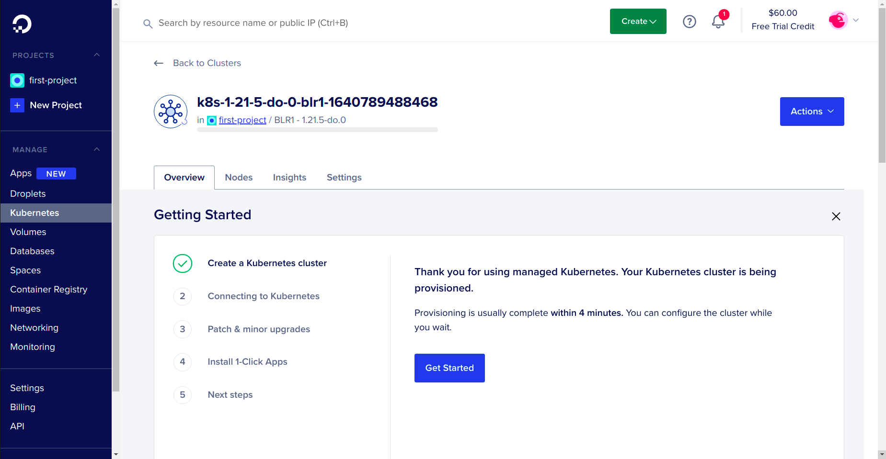
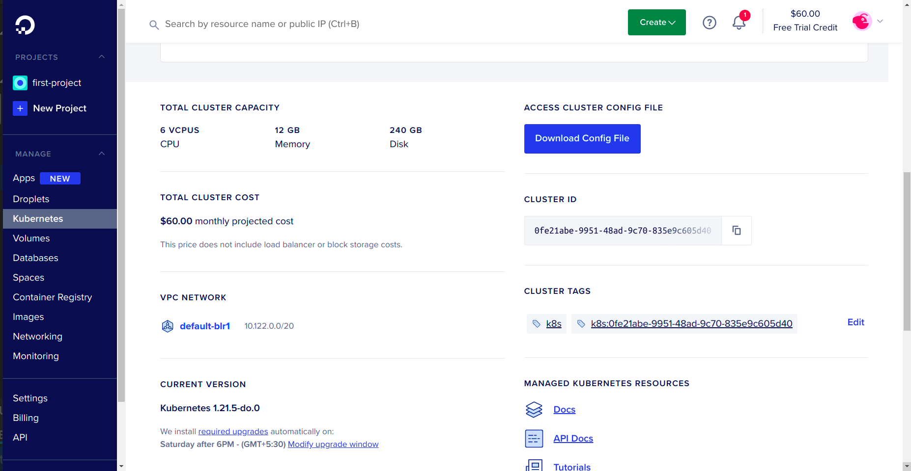
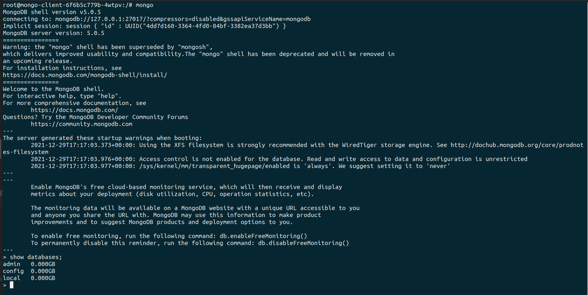

# Deploy MongoDB Cluster on Kubernetes

You can easily deploy MongoDB highly scalabale cluster on DigitalOcean Kubernetes Platform.
Some prerequisites:
- Git installed on your system
- [kubectl](https://kubernetes.io/docs/tasks/tools/) commandline tool installed

In the dashboard go to kubernetes section.

Select create new cluster

Fill out the form and your cluster will be setup within few minuites.


This is it. It is so simple to create a kubernetes cluster in DigitalOcean. Now we will setup mongoDB in our cluster.

## Connecting to K8s Cluster

After the successful creation of the cluster, you will be greeted with a panel like this:



Download the config file from the action tab:



Export the path of the config file to the KUBECONFIG environment variable:

```sh
export KUBECONFIG=kube_config_cluster.yml
```

## Creating MongoDB Secrets

Secrets in Kubernetes are the objects used for supplying sensitive information to containers.

To secure our MongoDB instance, we should always restrict access to the database with a password. Here we will use secrets to invoke our desired passwords to the containers.

Create the following file and name it `mongodb-secrets.yaml`.

```yaml
apiVersion: v1
data:
  password: #your password in bas64 encoding
  username: #your username in bas64 encoding
kind: Secret
metadata:
  creationTimestamp: null
  name: mongo-creds
```

P.S: The above username and password are encoded in base64 format.

Now run the following command to apply the changes to our K8s cluster.

```sh
kubectl apply -f mongodb-secrets.yaml
```

## Creating MongoDB Persistent Volume

We require volumes in K8s to store the data so that data is not lost when our cluster goes down.

In K8s, there are two objects which are required for creating volumes.

* Persistent Volume Claims (PVC): Kubernetes looks for a Persistent Volume from which space can be claimed and assigned for a PVC. PVC works only if the cluster has dynamic volume provisioning enabled.
* Persistent Volume (PV): A storage space which is provisioned by an administrator.

Create the following file and name it `mongodb-pvc.yaml`.

```yaml
apiVersion: v1
kind: PersistentVolumeClaim
metadata:
  name: mongo-data
spec:
  accessModes:
    - ReadWriteOnce 
  resources:
    requests:
      storage: 1Gi
```

Run the following command to create the PV.

```sh
kubectl create -f mongodb-pvc.yaml
```

P.S: If your cluster doesn't support PVC then follow the following steps.

Create `mongodb-pv.yaml` file and insert the following into it.

```yaml
apiVersion: v1
kind: PersistentVolume
metadata:
  name: mongo-data-pv
spec:
  accessModes:
    - ReadWriteOnce
  capacity:
    storage: 1Gi
  hostPath:
    path: /data/mongo
```

```sh
kubectl create -f mongodb-pv.yaml
```

## Deploying MongoDB image

We are going to use the official [Mongo image](https://hub.docker.com/_/mongo) from Docker hub.

Insert the following into a file and name it `mongodb-deployment.yaml`

```yaml
apiVersion: apps/v1
kind: Deployment
metadata:
  labels:
    app: mongo
  name: mongo
spec:
  replicas: 1
  selector:
    matchLabels:
      app: mongo
  strategy: {}
  template:
    metadata:
      labels:
        app: mongo
    spec:
      containers:
      - image: mongo
        name: mongo
        args: ["--dbpath","/data/db"]
        livenessProbe:
          exec:
            command:
              - mongo
              - --disableImplicitSessions
              - --eval
              - "db.adminCommand('ping')"
          initialDelaySeconds: 30
          periodSeconds: 10
          timeoutSeconds: 5
          successThreshold: 1
          failureThreshold: 6
        readinessProbe:
          exec:
            command:
              - mongo
              - --disableImplicitSessions
              - --eval
              - "db.adminCommand('ping')"
          initialDelaySeconds: 30
          periodSeconds: 10
          timeoutSeconds: 5
          successThreshold: 1
          failureThreshold: 6
        env:
        - name: MONGO_INITDB_ROOT_USERNAME
          valueFrom:
            secretKeyRef:
              name: mongo-creds
              key: username
        - name: MONGO_INITDB_ROOT_PASSWORD
          valueFrom:
            secretKeyRef:
              name: mongo-creds
              key: password
        volumeMounts:
        - name: "mongo-data-dir"
          mountPath: "/data/db"
      volumes:
      - name: "mongo-data-dir"
        persistentVolumeClaim:
          claimName: "mongo-data"
```

Then run the following command against your K8s.

```sh
kubectl create -f mongodb-deployment.yaml
```

## Running MongoDB from Shell

Now that we have successfully deployed the MongoDB instance on our cluster let's access the database through shell and run commands against it.

Save the file below as `mongodb-client.yaml`

```yaml
apiVersion: apps/v1
kind: Deployment
metadata:
  labels:
    app: mongo-client
  name: mongo-client
spec:
  replicas: 1
  selector:
    matchLabels:
      app: mongo-client
  template:
    metadata:
      labels:
        app: mongo-client
    spec:
      containers:
      - image: mongo
        name: mongo-client
        env:
        - name: mongo-client_INITDB_ROOT_USERNAME
          value: 'dummy'
        - name: mongo-client_INITDB_ROOT_PASSWORD
          value: 'dummy'
```

Now run the following command to deploy the client.

```sh
kubectl create -f mongodb-client.yaml
```

## Connecting to MongoDB from external Apps

To connect to our database from external app first we need to create svc for our K8s cluster. Save the following into a file and name it `mongodb-nodeport-svc.yaml`.

```yaml
apiVersion: v1
kind: Service
metadata:
  labels:
    app: mongo
  name: mongo-nodeport-svc
spec:
  ports:
  - port: 27017
    protocol: TCP
    targetPort: 27017
    nodePort: 32000
  selector:
    app: mongo
  type: NodePort
```

Now create the svc using the command:

```sh
kubectl create -f mongodb-nodeport-svc.yaml
```


Now let's ssh into the client.

```sh
kubectl exec deployment.apps/mongo-client -it -- /bin/bash
```

Now inside the ssh, let's enter the MongoDB instance using the username and password created above.

```sh
mongo --host mongo-nodeport-svc --port 27017 -u username -p pass
```

And finally execute the command in the database to verify that MongoDB has been successfully deployed.

```sh
show databases
```

